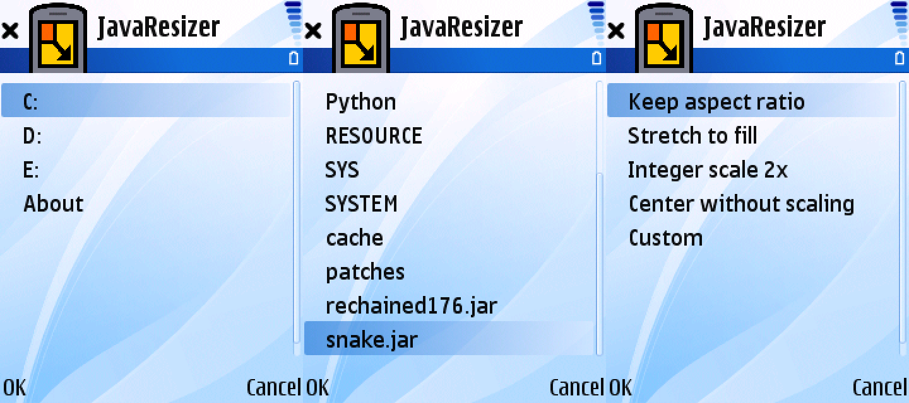
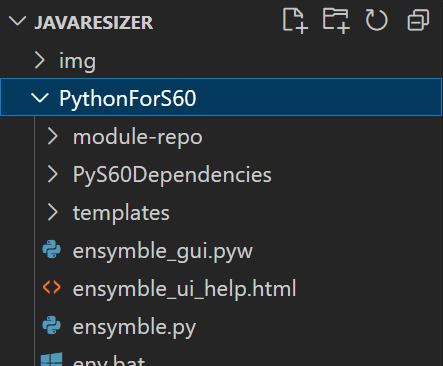

# JavaResizer
A [Python](https://web.archive.org/web/20090209230321/http://wiki.forum.nokia.com/index.php/Category:Python) app for Symbian S60v3 that adds [scaling parameters](https://github.com/Nokia64/J2ME-phone-quirks/blob/main/vendor-specific-MIDlet-attributes.md#series-60) to J2ME apps.

* File picker with access to all drives and Bluetooth received files
* 4 preset scaling options and custom option
* Doesn't modify the original JAR file, creates a temporary copy

The scaling doesn't use any smoothing filter, so for best results use 128x128 or 128x160 apps integer scaled to a 240x320 screen.

# Installation
Download PIPS, Python Runtime and JavaResizer SIS files from [GitHub](https://github.com/gtrxAC/JavaResizer/releases), [MEGA](https://mega.nz/folder/W5kmiTgR#adn6KNHKtCjlaWaMYNOBKQ) or [Google Drive](https://drive.google.com/drive/folders/1tCJ91m3OA5OndPLx4Pih4iNN1xnPKkHh?usp=sharing) and install them.

# Support
Currently only S60v3 Feature Pack 1 and above are supported. S60v5 and anything newer should work too, but are untested.

Tested on the following devices:
* Nokia E52 - working, but asks for access point when starting
* Nokia N95 - working
* Nokia E70 - not supported "make sure PIPS and Python runtime are installed"
* Nokia N73 - not supported "make sure PIPS and Python runtime are installed"

# Building
So far I've only been able to build on Windows.
1. Install [Python 2.5](https://www.python.org/downloads/release/python-254/). 2.7 won't work because it's not bytecode compatible. Python doesn't provide Linux binaries so it would have to be manually compiled, I had issues with that.
<!-- 2. Download Python for S60 [here](https://web.archive.org/web/20210506205822/https://garage.maemo.org/frs/download.php/7486/PythonForS60_2.0.0.tar.gz) and extract it to this directory. -->
2. Install Python for S60 [here](https://web.archive.org/web/20200927123819/https://garage.maemo.org/frs/download.php/7485/PythonForS60_2.0.0_Setup.exe). For the installation directory, navigate to this folder and create a `PythonForS60` folder inside. After installing, the directory structure should look like this:

3. Run `build.bat`.